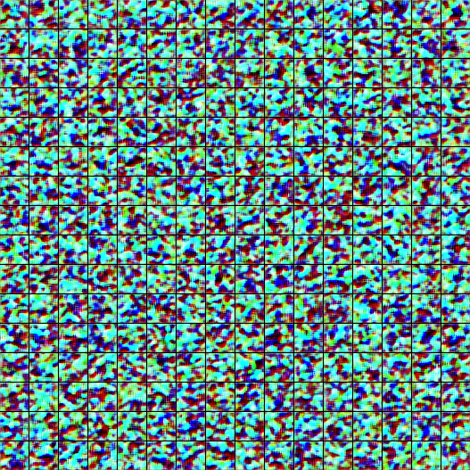
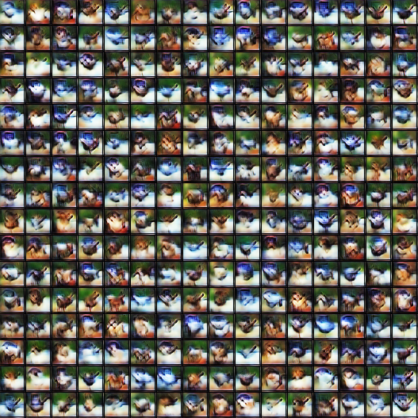

# DataFree

A benchmark of data-free knowledge distillation from paper ["Contrastive Model Inversion for Data-Free Knowledge Distillation"](https://arxiv.org/abs/2105.08584)

|  |  |  |
| :---: | :---: | :---: |
| CMI (this work) |  DeepInv | 
|   |  |  |
| ZSKT | DFQ |
|      |  |
## Results

### 1. CIFAR-10

| Method | resnet-34 <br> resnet-18 | vgg-11 <br> resnet-18 | wrn-40-2 <br> wrn-16-1 | wrn-40-2 <br> wrn-40-1 | wrn-40-2 <br> wrn-16-2 |
| :-------: | :--------: | :-----: | :---: | :----: | :---: |
| T. Scratch |   95.70  | 92.25 | 94.87 | 94.87 | 94.87 |
| S. Scratch |   95.20  | 95.20 | 91.12 | 93.94 | 93.95 |
| DAFL | 92.22 | 81.10 | 65.71 | 81.33 | 81.55 |
| ZSKT | 93.32 | 89.46 | 83.74 | 86.07 | 89.66 |
| DeepInv  | 93.26 | 90.36 | 83.04 | 86.85 | 89.72 |
| DFQ  | 94.61 | 90.84 | 86.14 | 91.69 | 92.01 |
| CMI  | 94.84 | 91.13 | 90.01 | 92.78 | 92.52 |

### 2. CIFAR-100

| Method | resnet-34 <br> resnet-18 | vgg-11 <br> resnet-18 | wrn-40-2 <br> wrn-16-1 | wrn-40-2 <br> wrn-40-1 | wrn-40-2 <br> wrn-16-2 |
| :-------: | :--------: | :-----: | :---: | :----: | :---: |
| T. Scratch |   78.05  | 71.32 | 75.83 | 75.83 | 75.83 |
| S. Scratch |   77.10  | 77.01 | 65.31 | 72.19 | 73.56 |
| DAFL | 74.47 | 57.29 | 22.50 | 34.66 | 40.00 |
| ZSKT | 67.74 | 34.72 | 30.15 | 29.73 | 28.44 |
| DeepInv  | 61.32 | 54.13 | 53.77 | 61.33 | 61.34 |
| DFQ  | 77.01 | 68.32 | 54.77 | 62.92 | 59.01 |
| CMI  | 77.04 | 70.56 | 57.91 | 68.88 | 68.75 |

## Quick Start

### 1. Visualize the inverted samples

Results will be saved as `checkpoints/datafree-cmi/synthetic-cmi_for_vis.png`
```bash
bash scripts/cmi_cifar10_for_vis.sh
```

### 2. Reproduce our results

*Note: This repo was refactored from our experimental code and is still under development. I'm struggling to find the appropriate hyperparams for each methods (°ー°〃). So far, we only provide the hyperparameters to reproduce CIFAR-10 results for wrn-40-2 => wrn-16-1. You may need to tune the hyper-parameters for other models and datasets. More resources will be uploaded in the future update.*

To reproduce our results, please download pre-trained teacher models from [Dropbox-Models (266 MB)](https://www.dropbox.com/sh/w8xehuk7debnka3/AABhoazFReE_5mMeyvb4iUWoa?dl=0) and extract them as `checkpoints/pretrained`. Also a pre-inverted data set with ~50k samples is available for wrn-40-2 teacher on CIFAR-10. You can download it from [Dropbox-Data (133 MB)](https://www.dropbox.com/s/enaj6c63heq5n4j/cmi-preinverted-wrn402.zip?dl=0) and extract them to `run/cmi-preinverted-wrn402/`. 

* **Adversarial CMI**: you can apply the adversarial distillation based on the pre-inverted data, where ~10k (256x40) new samples will be generated to improve the student. It should reach the accuracy of **~90.01%** on CIFAR-10 as reported in Table 1. 

      bash scripts/reproduce/adv_cmi_cifar10.sh

* **Non-adversarial CMI**: Or you can train a student model on inverted data directly. It should reach the accuracy of **~87.38%** on CIFAR-10 as reported in Figure 3.

      bash scripts/reproduce/nonadv_cmi_cifar10.sh


* **Scratch CMI**: It is OK to run the cmi algorithm wihout any pre-inverted data, but the student may overfit to early samples due to the limited data amount. It should reach the accuracy of **~88.82%** on CIFAR-10, slightly worse than our reported results (90.01%).

      bash scripts/reproduce/scratch_cmi_cifar10.sh
      
### 3. Scratch training

```bash
python train_scratch.py --model wrn40_2 --dataset cifar10 --batch-size 256 --lr 0.1 --epoch 200 --gpu 0
```

### 4. Vanilla KD
```bash
# KD with original training data (beta>0 to use hard targets)
python vanilla_kd.py --teacher wrn40_2 --student wrn16_1 --dataset cifar10 --transfer_set cifar10 --beta 0.1 --batch-size 128 --lr 0.1 --epoch 200 --gpu 0 

# KD with unlabeled data
python vanilla_kd.py --teacher wrn40_2 --student wrn16_1 --dataset cifar10 --transfer_set cifar100 --beta 0 --batch-size 128 --lr 0.1 --epoch 200 --gpu 0 

# KD with unlabeled data from a specified folder
python vanilla_kd.py --teacher wrn40_2 --student wrn16_1 --dataset cifar10 --transfer_set run/cmi --beta 0 --batch-size 128 --lr 0.1 --epoch 200 --gpu 0 
```

### 5. Data-free KD

```bash
bash scripts/xxx.sh
```
Hyper-parameters for different methods: 

| Method | adv | bn | oh | balance | act | cr | GAN | Example |
| :-: | :-: | :-: | :-: | :-: | :-: | :-: | :-: | :-: |
| DAFL | - | - | √ | √ | √ | - | √ | scripts/dafl_cifar10.sh |
| ZSKT | √ | - | - | - | - | - | √ | scripts/zskt_cifar10.sh |
| DeepInv | √ | √ | √ | - | - | - | - | scripts/deepinv_cifar10.sh |
| DFQ | √ | √ | √ | √ | - | - | √ | scripts/dfq_cifar10.sh |
| CMI | √ | √ | √ | - | - | √ | √ | scripts/cmi_cifar10_scratch.sh |

### 4. Use your models/datasets

You can register your models and datasets in registry.py by modifying `NORMALIZ_DICT`, `MODEL_DICT` and `get_dataset`. Then you can run the above commands to train your own models. As DAFL requires intermediate features from the penultimate layer, your model should accept an `return_features=True` parameter and return a (logits, features) tuple for DAFL.  


### 5. Implement your algorithms

Your algorithms should inherent `datafree.synthesis.BaseSynthesizer` to implement two interfaces: 1) `BaseSynthesizer.synthesize` takes several steps to craft new samples and return an image dict for visualization; 2) `BaseSynthesizer.sample` fetches a batch of training data for KD.

## Citation
If you found this work useful for your research, please cite our paper:
```
@misc{fang2021contrastive,
      title={Contrastive Model Inversion for Data-Free Knowledge Distillation}, 
      author={Gongfan Fang and Jie Song and Xinchao Wang and Chengchao Shen and Xingen Wang and Mingli Song},
      year={2021},
      eprint={2105.08584},
      archivePrefix={arXiv},
      primaryClass={cs.AI}
}
```

## Reference

* ZSKT: [Zero-shot Knowledge Transfer via Adversarial Belief Matching](https://arxiv.org/abs/1905.09768)
* DAFL: [Data-Free Learning of Student Networks](https://arxiv.org/abs/1904.01186)
* DeepInv: [Dreaming to Distill: Data-free Knowledge Transfer via DeepInversion](https://arxiv.org/abs/1912.08795)
* DFQ: [Data-Free Network Quantization With Adversarial Knowledge Distillation](https://arxiv.org/abs/2005.04136)
